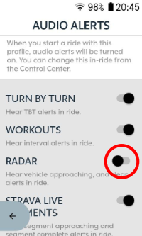
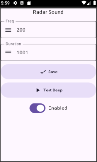

# Hammerhead Karoo radar sound extension

Hammerhead Karoo extension which allow to configure radar alerts

## Requirements
**You must disable default radar sound in Karoo settings\
Go to Profiles -> Your profile -> Audio Alerts -> Disable RADAR**\
\

## Installation
Karoo 3
1. [LINK](https://github.com/itxsvv/kxradar/releases/latest/download/app-release.apk)\
Tap on the link and share app with Hammerhead Companion App

Karoo 2:

1. Download the apk from the [releases page](https://github.com/itxsvv/kxradar/releases)
2. Set up your Karoo for sideloading. DC Rainmaker has a great [step-by-step guide](https://www.dcrainmaker.com/2021/02/how-to-sideload-android-apps-on-your-hammerhead-karoo-1-karoo-2.html).
3. Install the app by running `adb install app-release.apk`.

## Usage
Set frequency and duration of the sound and tap 'Save'\

## Links
Official SDK
[karoo-ext source](https://github.com/hammerheadnav/karoo-ext)\
Specail thanks for examples to **timklge**
[github](https://github.com/timklge?tab=repositories)

