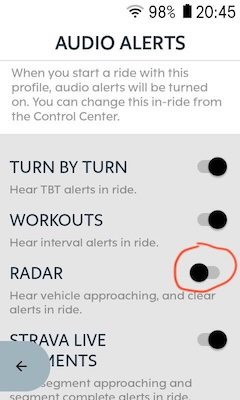
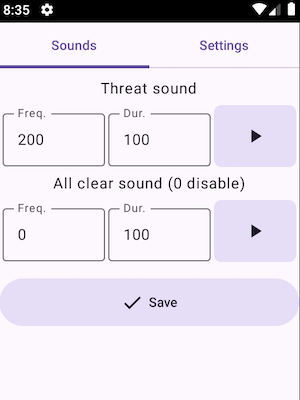
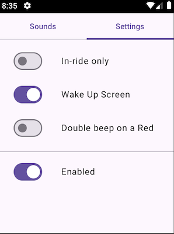
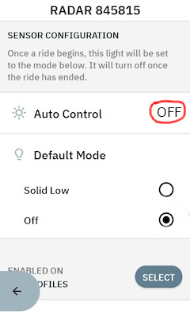
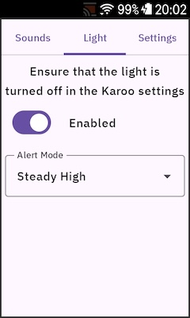

## Radar Sound Extension for Hammerhead Karoo

Hammerhead Karoo extension that allows configuring radar alerts  
and controlling the radar light.

##
**I recommend using the light control extension instead of the embedded kxradar light control.  
[KarooFireFly ANT+ & Bluetooth Smart Bike Light Controller for Hammerhead Karoo 3](https://github.com/derstrassi/karoofirefly)**

## Requirements

**You must disable the default radar sound in the Karoo settings.\
Go to Profiles -> Your profile -> Audio Alerts -> Disable RADAR**\
\

## Installation

Karoo 3

1. [LINK to APK](https://github.com/itxsvv/kxradar/releases/latest/download/app-release.apk)\
   Share this link with the Hammerhead Companion App.

Karoo 2:

1. Download the APK from the [releases page](https://github.com/itxsvv/kxradar/releases)
2. Set up your Karoo for sideloading. DC Rainmaker has a
   great [step-by-step guide](https://www.dcrainmaker.com/2021/02/how-to-sideload-android-apps-on-your-hammerhead-karoo-1-karoo-2.html).
3. Install the app by running `adb install app-release.apk`.

## Usage
**Radar**
Set the frequency and duration of the sound, and tap ‘Save.’\

**Ligt**
Experimental feature (Special thanks to **derstrassi**)  
Light control turns the light on when a vehicle is detected  
and off when the road is clear, saving battery.  
Only ONE light is supported.  
Tested with Garmin Varia 516 (this radar has only one mode).  
**Please disable automatic light control in the sensor settings and set the default light mode to Off.**

## Known issues
If you add a new radar, a device restart is required.

## Links

Official SDK
[karoo-ext source](https://github.com/hammerheadnav/karoo-ext)\
Specail thanks to   
**timklge** [github](https://github.com/timklge?tab=repositories)  
**derstrassi** [github](https://github.com/derstrassi)  
... 